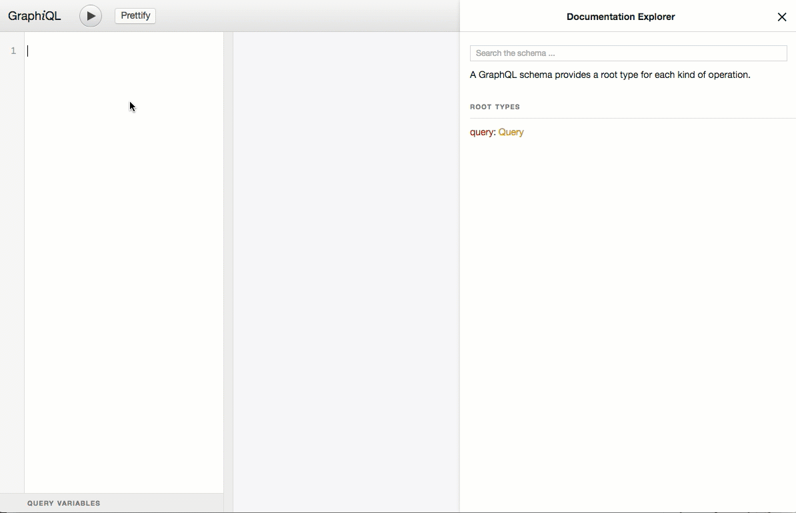

# [WIP] MojiLaLa Partnership GraphQL API Documentation

12,000 original stickers by 300+ artists all over the world.

## Access and API Keys

`x-api-key` header is required.

#### Public Beta Key

* The public beta key is "fCwSnMW0cR9BqTdrgWODZ1SdqWSmzAxA4NVu3Uho”
* The beta endpoint is https://api-partnerships.mojilala.com/v1_beta/graphql

#### Request a production API Key

* Please send a message https://mojilala.com/partnership/
* The production endpoint is https://api-partnerships.mojilala.com/v1_production/graphql

## Overview

GraphQL natively supports performing an introspection query. As our GraphQL schema matures, you will automatically receive new data types as we release updates to the platform. The documentation on this repo will also be updated.

### Using GraphiQL
We recommend downloading and installing the GraphiQL App. This is the same editor that the GraphQL Explorer uses.

<p align="center">

</p>


### Using curl HTTP-speaking library


## Queries

Every GraphQL schema has a root type for both queries and mutations.

The root type defines how GraphQL operations begin. It is the entry point to constructing GraphQL queries.

For more information, see the [GraphQL spec](https://facebook.github.io/graphql/#sec-Type-System).

### Connections

#### stickers

A sticker.

##### Search stickers

```
curl -I https://api-partnerships.mojilala.com/v1_beta/graphql --header "x-api-key: fCwSnMW0cR9BqTdrgWODZ1SdqWSmzAxA4NVu3Uho" -d 'query=
{
  stickers(query: "Hello", language_code: "en"){
    edges{
      node{
        id
        fileUrl
      }
    }
  }
}
'
```

##### Search animated stickers

```
curl -I https://api-partnerships.mojilala.com/v1_beta/graphql --header "x-api-key: fCwSnMW0cR9BqTdrgWODZ1SdqWSmzAxA4NVu3Uho" -d 'query=
{
  stickers(query: "Hello", isAnimated: true, language_code: "en"){
    edges{
      node{
        id
        fileUrl
      }
    }
  }
}
'
```

##### Get stickers of specific tag

```
curl -I https://api-partnerships.mojilala.com/v1_beta/graphql --header "x-api-key: fCwSnMW0cR9BqTdrgWODZ1SdqWSmzAxA4NVu3Uho" -d 'query=
{
  stickers(taggedWith: "halloween"){
    edges{
      node{
        id
        fileUrl
      }
    }
  }
}
'
```

#### packages

Collection of related stickers.

##### Search sticker packages
```
curl -I https://api-partnerships.mojilala.com/v1_beta/graphql --header "x-api-key: fCwSnMW0cR9BqTdrgWODZ1SdqWSmzAxA4NVu3Uho" -d 'query=
{
  packages(query: "Hello", language_code: "en"){
    edges{
      node{
        id
        defaultSticker{
          id
          fileUrl
        }
      }
    }
  }
}
'
```
##### Search animated sticker packages
```
curl -I https://api-partnerships.mojilala.com/v1_beta/graphql --header "x-api-key: fCwSnMW0cR9BqTdrgWODZ1SdqWSmzAxA4NVu3Uho" -d 'query=
{
  packages(query: "Hello", isAnimated: true, language_code: "en"){
    edges{
      node{
        id
        defaultSticker{
          id
          fileUrl
        }
      }
    }
  }
}
'
```

#### featured

Featured sticker packages as grouped.

```
curl -I https://api-partnerships.mojilala.com/v1_beta/graphql --header "x-api-key: fCwSnMW0cR9BqTdrgWODZ1SdqWSmzAxA4NVu3Uho" -d 'query=
{
  featured{
    edges{
      node{
        name
        packages{
          edges{
            node{
              name
              defaultSticker{
                id              
                fileUrl
              }
            }
          }
        }
      }
    }
  }
}
'
```

### Fields

####    